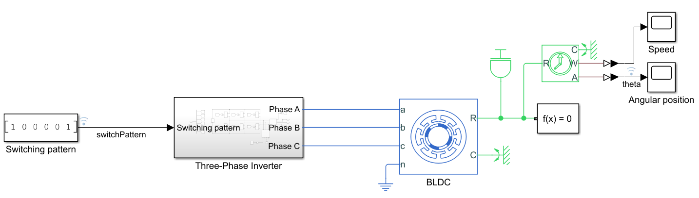
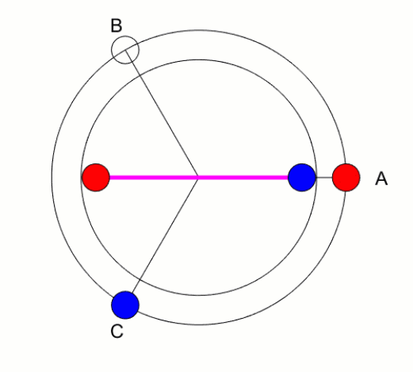

# Modeling a Three-Phase Inverter
### Copyright 2019 The MathWorks, Inc.

This repository contains the MATLAB and Simulink files used in the [How to Design Motor Controllers Using Simscape Electrical, Part 2: Modeling a Three-Phase Inverter](https://www.youtube.com/watch?v=dghUC_IAj1Q&list=PLn8PRpmsu08pqegLB5CqfgZCtuK5UKIrx&index=2) video. Check out the rest of the videos in [this section](#videos).

## Model & Setup
The provided model lets you simulate a BLDC motor which is driven by a three-phase inverter. A snapshot of the model is given below. 

In the model, the BLDC motor is set up to have a single pole pair in the rotor and the three-phase inverter is driven with a static switching pattern simultaneously energizing phases A and C. The following animation shows the resulting rotor alignment.

You can do the following with the provided files:

- Run Simulink model (Modeling_three_phase_inverter.slx) and observe angular position and speed responses of the BLDC motor using the provided scopes.

- Run MATLAB file (animateRotorPosition.m) to create the BLDC motor animation seen above (also at 7:23 in the video). After running the MATLAB file, press any button to start the animation. The MATLAB file runs the Simulink model, and uses the simulated data to animate the BLDC motor.

## Videos & Files
"How to Design Motor Controllers Using Simscape Electrical" video series consists of 5 videos. Click the links below to watch the videos and download the files. 

  - Part 1: Simulating Back-EMF Voltage of a BLDC Motor [[Watch video](https://www.youtube.com/watch?v=JDgvBZbnfPw&list=PLn8PRpmsu08pqegLB5CqfgZCtuK5UKIrx&index=1), [Download files](https://github.com/mathworks/Design-motor-controllers-with-Simscape-Electrical/tree/master/1-Simulating-back-emf-voltage-of-a-BLDC-motor)]
  - Part 2: Modeling a Three-Phase Inverter [[Watch video](https://www.youtube.com/watch?v=dghUC_IAj1Q&list=PLn8PRpmsu08pqegLB5CqfgZCtuK5UKIrx&index=2), [Download files](https://github.com/mathworks/Design-motor-controllers-with-Simscape-Electrical/tree/master/2-Modeling-a-three-phase-inverter)]
  - Part 3: Modeling Commutation Logic [[Watch video](https://www.youtube.com/watch?v=NH0O1-mjysU&list=PLn8PRpmsu08pqegLB5CqfgZCtuK5UKIrx&index=3), [Download files](https://github.com/mathworks/Design-motor-controllers-with-Simscape-Electrical/tree/master/3-Modeling-commutation-logic)]
  - Part 4: Model PWM-Controlled Buck Converters [[Watch video](https://www.youtube.com/watch?v=bMJVmyv76Bs&list=PLn8PRpmsu08pqegLB5CqfgZCtuK5UKIrx&index=4), [Download files](https://github.com/mathworks/Design-motor-controllers-with-Simscape-Electrical/tree/master/4-Modeling-a-PWM-controlled-buck-converter)]
  - Part 5: An Alternative implementation of PWM Control [[Watch video](https://www.youtube.com/watch?v=_abK4wVDL4Y&list=PLn8PRpmsu08pqegLB5CqfgZCtuK5UKIrx&index=5), [Download files](https://github.com/mathworks/Design-motor-controllers-with-Simscape-Electrical/tree/master/5-PWM-control-of-a-BLDC-motor)]

Check out [this tech talk video series](https://www.youtube.com/playlist?list=PLn8PRpmsu08qL-EG3DRMtRyokpXQJyhp7) to understand: 
  
- How brushless DC motors differ from brushed DC motors and how they work 
- How BLDC motors can be controlled using six-step commutation (trapezoidal control)
- The different components of a BLDC motor control algorithm such as PWM control, commutation logic, three-phase inverter and sensor. 

